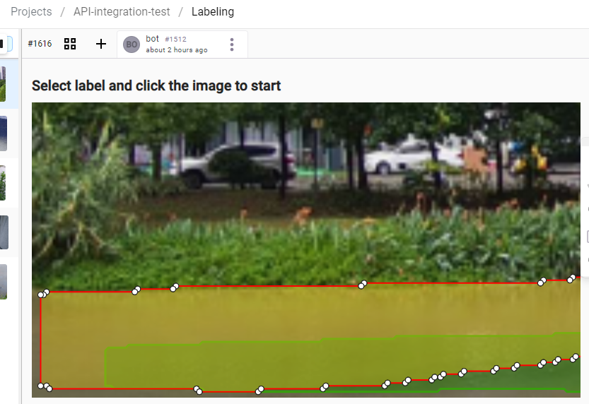

# Label Studio Autopilot

[中文说明](readme.md)

Use Detectron2 to create image segmentation annotations for Label Studio projects automatically.

Open source under Mulan PSL v2 license.

## Environment

* Java 21
  * Why Java? Because Python sucks.
* [My forked and modified Detectron2](https://github.com/FirokOtaku/Detectron2)
  It adds some utility scripts, which enable exchanging data between languages and frameworks.
* [Label Studio](https://github.com/HumanSignal/label-studio/)
  * The current project has been tested with Label Studio 1.10.1 dev version.  
    Other versions of Label Studio should also work.

## Usage

1. Compile this project and prepare the above environment
2. Provide a JSON5 configuration file ([example configuration file](config-template.json5)),
   and place it at the `./config.json5` path
3. Start running

> Because this project uses several Java libraries written by myself  
> and these projects are published in the GitHub Maven repository.
> You may need to modify Maven configuration to access GitHub Maven repository to pull dependencies.
> 
> * [Label Studio Connector Java](https://github.com/FirokOtaku/LabelStudioConnectorJava)
> * [Topaz](https://github.com/FirokOtaku/Topaz)
> * [Alloy Wrench](https://github.com/FirokOtaku/AlloyWrench)

If started in `AnnotateServer` mode, the default port is `39270`.
It is recommended to use the additional shortcuts provided by `label-studio-optimizer.user.js` in [Candy Pot](https://github.com/FirokOtaku/CandyPot).
